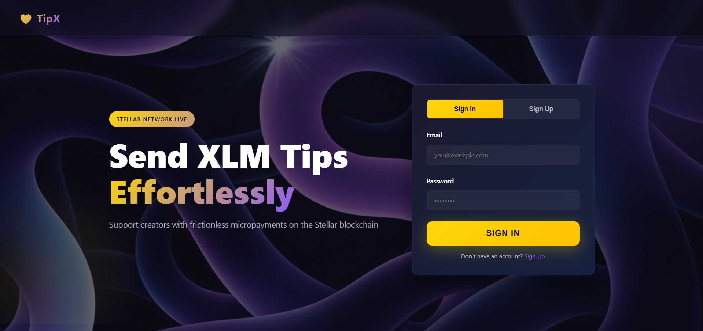
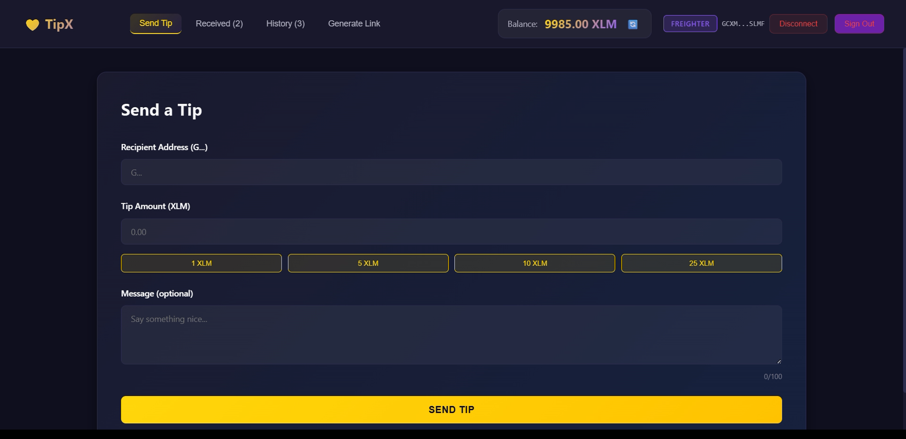
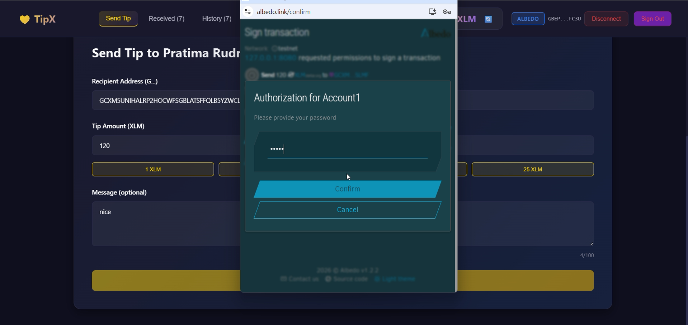
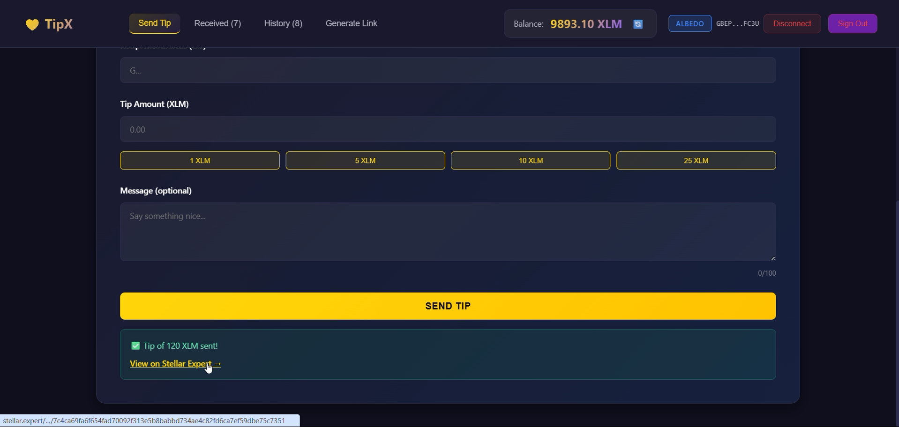
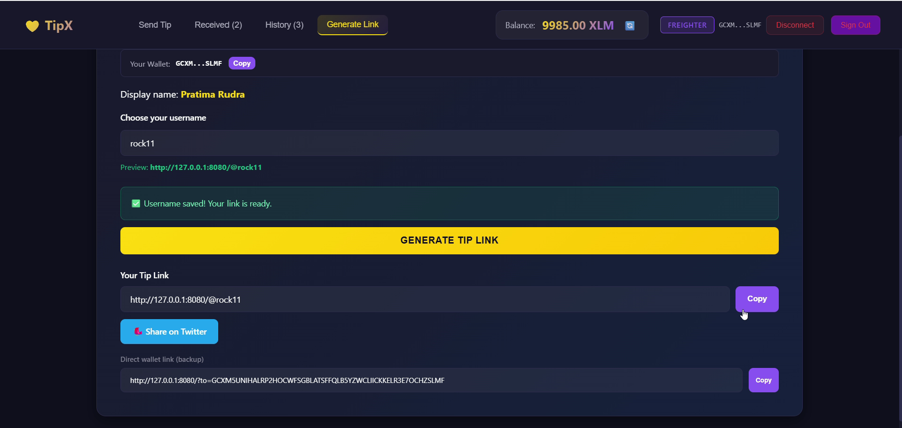
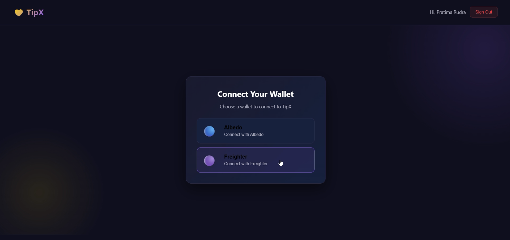
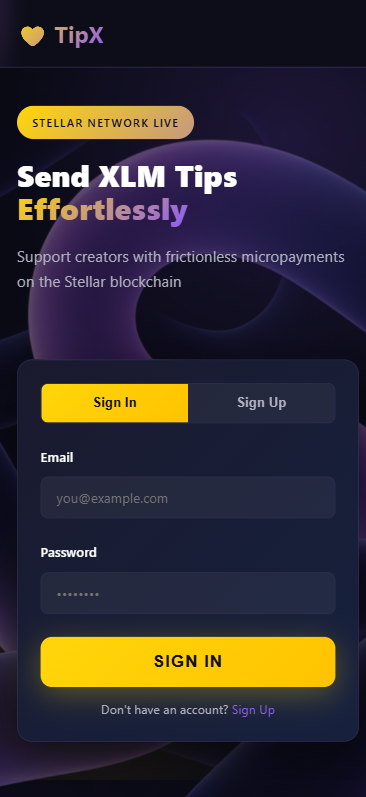

# 💛 TipX — Send XLM Tips Effortlessly

**TipX is a decentralized tipping app built on the Stellar blockchain.** It lets anyone send XLM (Stellar Lumens) tips to creators in seconds — no middlemen, no custodians, no private keys ever leaving your wallet. Creators set up a profile with custom tip presets, generate a shareable tip link, and start receiving support from their audience. Every tip is a real on-chain Stellar payment, and tips can additionally be logged to a Soroban smart contract for a transparent, verifiable record.

Built with a lightweight React frontend, Stellar SDK, and a Soroban (Rust) smart contract, TipX makes web3 tipping feel as smooth as a Web2 app.

 

 ## ✨ Features

- 🔐 **Non-custodial wallet sign-in** — connect with **Albedo** or **Freighter**; TipX never sees your keys
- 💸 **Send tips** to any Stellar address with optional messages and quick-amount buttons
- 🎨 **Creator profiles** — name, bio, and custom tip presets that persist per wallet
- 🔗 **Shareable tip links** — generate a link and let your audience tip you directly
- 📊 **Transaction history** — view tips sent and received, with links to Stellar Expert
- ⚡ **Real-time XLM balance** and instant on-chain confirmations
- 📱 **Responsive design** — works across mobile, tablet, and desktop

---

## 📜 Smart Contract Info

TipX includes a **Soroban smart contract** (written in Rust) that logs tips on-chain for a transparent, tamper-proof record.

| Item | Value |
|------|-------|
| **Network** | Stellar Testnet |
| **Contract ID** | `CAN7F5MOB2EA2LFARTU64JJ2BADTDGBXIV4Z6JFKLPJU2E75OPZTAZ57` |
| **Network Passphrase** | `Test SDF Network ; September 2015` |
| **Horizon API** | `https://horizon-testnet.stellar.org` |
| **Source** | [`contracts/tipx/src/lib.rs`](contracts/tipx/src/lib.rs) |
| **SDK** | `soroban-sdk` v22.0.0 |


 View the contract on [Stellar Lab (Testnet)](https://lab.stellar.org/smart-contracts/contract-explorer?$=network$id=testnet&label=Testnet&horizonUrl=https:////horizon-testnet.stellar.org&rpcUrl=https:////soroban-testnet.stellar.org&passphrase=Test%20SDF%20Network%20/;%20September%202015;&smartContracts$explorer$contractId=CAN7F5MOB2EA2LFARTU64JJ2BADTDGBXIV4Z6JFKLPJU2E75OPZTAZ57;;)

## 🚀 Live Demo

- **Vercel Deployment:** [click me](https://tip-x-nine.vercel.app/)
- **Demo Video:** [click me](https://youtu.be/wsG7yMoHVao)

## 🛠️ Tech Stack

**Frontend**
- React 18 (UMD + Babel Standalone for in-browser JSX)
- Vanilla CSS with gradient effects and animations
- Inter font (Google Fonts)

**Blockchain**
- [Stellar SDK](https://github.com/stellar/js-stellar-sdk) `10.4.1` — payments & account data
- [Soroban](https://soroban.stellar.org/) smart contract (Rust, `soroban-sdk` 22.0.0)
- Horizon API (Stellar Testnet)

**Wallets**
- [Albedo](https://albedo.link)
- [Freighter](https://freighter.app)

**Backend / Storage**
- Node.js static file server ([`server.js`](server.js))
- Firebase Firestore (creator profiles & metadata)


## CI/CD active for both frontend & contract.  

  ## 💻 How to Run Locally

### Prerequisites
- [Node.js](https://nodejs.org/) installed
- A Stellar wallet extension — [Albedo](https://albedo.link) or [Freighter](https://freighter.app)

### Steps

```bash
# 1. Clone the repository
git clone <your-repo-url>
cd Tipx

# 2. Install dependencies
npm install

# 3. Start the local server
npm start
```

Then open **http://127.0.0.1:8080** in your browser.

### Get Testnet XLM (optional, for testing)
1. Visit [https://friendbot.stellar.org](https://friendbot.stellar.org)
2. Enter your Stellar address
3. FriendBot funds your account with test XLM

> 💡 For a full walkthrough of connecting a wallet and sending your first tip, see [`QUICK_START.md`](QUICK_START.md).

---

## 📸 Screenshots

| Landing Page | Dashboard |
|:---:|:---:|
|  |  |

| Send Tip (Albedo) | Payment (Freighter) |
|:---:|:---:|
|  | .png>) |

| Tip Sent Confirmation | Generate Tip Link |
|:---:|:---:|
|  |  |

| Different Wallet | Profile Response |
|:---:|:---:|
|  |  |

---


## 🎯 Conclusion

TipX demonstrates how blockchain can power a genuinely useful, everyday experience — supporting creators directly with fast, low-cost, transparent payments. By combining Stellar's speed and tiny fees with a Soroban smart contract for on-chain tip records and a polished React interface, TipX bridges the gap between web3 power and Web2 simplicity.

Whether you're a creator looking to receive support or a supporter wanting to tip your favorites, TipX makes decentralized tipping effortless. 💛

---

<p align="center">Built with 💛 on Stellar</p>

